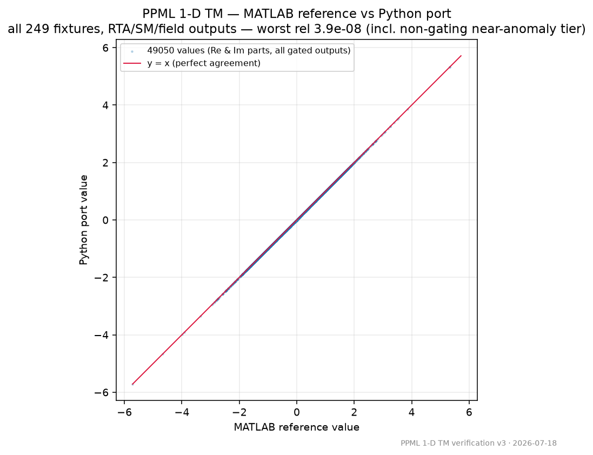
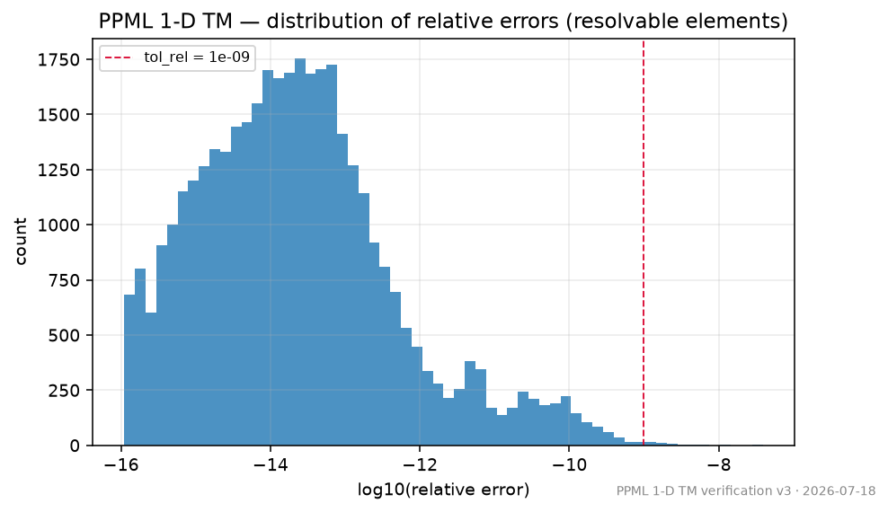
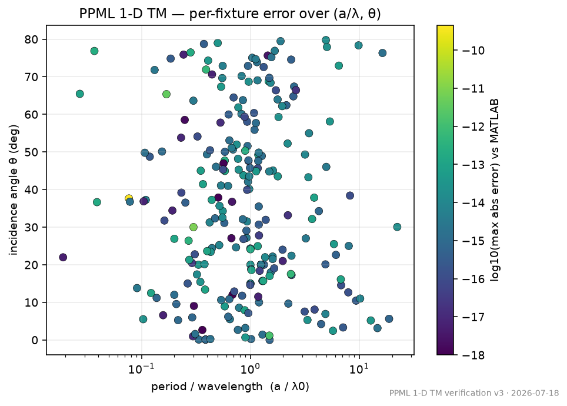
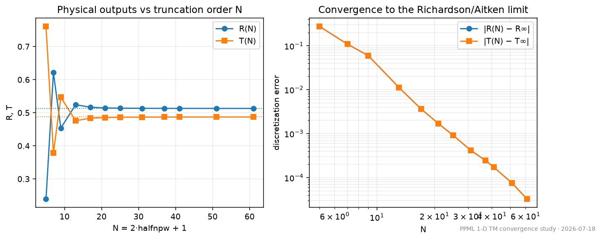

# PPML 1-D TM — Verified MATLAB → Python Migration

A Python port of the PPML v3.0 (Zanotto et al.) RCWA scattering-matrix routines
(`RTA_1d_tm`, `SM_1d_tm`, `field_1d_tm`, 1-D TM function group), delivered **with a
verification harness that proves the Python results reproduce the original MATLAB
numerically** — 249 seeded physics fixtures, budget-derived per-output tolerances, and a
single self-explanatory report you can read without trusting us.

[](https://github.com/GrednevMSU/ppml-1d-tm-verify/actions/workflows/verify.yml)


[](LICENSE)
[](https://github.com/astral-sh/ruff)

> The CI badge covers one workflow with four jobs: MATLAB-equivalent verification on
> **GNU Octave**, the **pytest** matrix (3.9/3.11/3.13) against the committed MATLAB
> golden, **ruff** lint, and **notebook** execution. The authoritative MATLAB gate and
> the MATLAB-vs-Octave cross-engine check are run locally — see below.

---

## Executive summary of the verification

The Python port was checked against the original MATLAB on **249 fixtures** spanning
subwavelength-to-multi-order periods, 0–80° incidence, dielectric and metallic (lossy)
layers, and conducting interfaces. Reflectance/Transmittance and S-matrix coefficients
agree with MATLAB at the level predicted by the accumulated round-off budget (~8×10⁻¹²
absolute); sampled fields agree to ~3×10⁻¹⁰ relative (looser by physics — thick-metal
evanescent dynamic range — not by porting). Validated live against **MATLAB R2025a** and
**GNU Octave 11.3**. Two bugs in the original code are documented and reproduced
bug-for-bug rather than silently fixed — a truncated vacuum-impedance constant, and an
energy-conservation "guard" that is a mathematical tautology and fails open on NaN and on
a documented-forbidden complex-permittivity input (see `ORIGINAL_CODE_FINDINGS.md`).



*MATLAB reference vs Python port for every numeric output across all 249 fixtures
(RTA/SM/field, real and imaginary parts); points lie on the y = x line.*

Full interactive report: [`report.html`](report.html) (open the raw file, or run
`./verify.sh` to regenerate it yourself) — see also the
[scenario coverage matrix and tier breakdown](verification_report.md).

### Supporting evidence

| | |
|---|---|
|  |  |
| Distribution of relative errors, with the tolerance line. | Per-fixture error over the (period/λ, incidence angle) plane. |
|  | **Independent triangulation.** A grating with equal inclusion and host permittivity is a uniform multilayer, so the RCWA result must reduce to a first-principles thin-film TMM. It does, to **~1e-16** (`verify/triangulate.py`). |
| Physical outputs vs truncation order N, with a Richardson/Aitken limit and discretization-error estimate (`verify/convergence.py`). | These are non-gating INFO checks — extra, independent trust signals beyond the MATLAB gate. |

---

## Verify it yourself (English) — 3 steps

You need **Python 3** and **either MATLAB or GNU Octave** (Octave is free:
<https://octave.org>). Nothing else.

1. **Open a terminal in this folder.**
2. **Run one command:**
   - macOS / Linux:  `./verify.sh`
   - Windows:        `verify.bat`
3. **Read `report.html`** (it opens automatically). A green banner = the Python port
   matches the original. A red banner = a difference was found, explained in the report.

That's it. The script installs the Python libraries into a local folder (`.venv/`),
runs the ORIGINAL MATLAB/Octave code over the frozen test set, runs the Python port,
compares them, and writes the report.

## Проверьте сами (по-русски) — 3 шага

Нужны только **Python 3** и **MATLAB или GNU Octave** (Octave бесплатный:
<https://octave.org>).

1. **Откройте терминал в этой папке.**
2. **Выполните одну команду:**
   - macOS / Linux:  `./verify.sh`
   - Windows:        `verify.bat`
3. **Посмотрите `report.html`** (откроется сам). Зелёный баннер — Python-порт совпадает
   с оригиналом. Красный — найдено расхождение, оно объяснено в отчёте.

Скрипт сам ставит Python-библиотеки в локальную папку (`.venv/`), прогоняет ОРИГИНАЛЬНЫЙ
код MATLAB/Octave по замороженному набору тестов, прогоняет Python-порт, сравнивает и
пишет отчёт.

---

## What the report tells you

- **Big PASSED/FAILED banner** and a plain-language executive summary.
- Per-function residuals (max relative and max absolute, worst-case fixtures reported
  separately), with the tolerance each is judged against and a one-line justification.
- **Pass logic:** an output passes iff `rel_err ≤ tol_rel` **OR** `abs_err ≤ tol_abs`.
  Every status self-explains: `PASS(rel)`, `PASS(abs)`, `PASS(both)`, `FAIL`,
  `INFO(non-gating)`, `DEVIATION(flag=…)`.
- A cross-engine panel (MATLAB vs Octave) — if both are installed — as an independent
  trust signal.
- Scenario-coverage matrix, tiers (near-anomaly / resonance), scope & limitations, and a
  footer with exact engine + BLAS/LAPACK versions for reproducibility.

## Architecture (one paragraph + diagram)

The original MATLAB is copied verbatim into `matlab_src/` and never modified. A frozen
corpus of 249 input fixtures (`fixtures/*.mat`, each SHA-256'd in `manifest.json`) drives
both sides. `run_reference.m` runs the original on MATLAB (reference of record) and Octave
(cross-check); `compare.py` runs the Python port in `python_src/`, applies budget-derived
tolerances from `tolerances.yaml`, and emits the report. A run compares three ways: Python
vs reference (the gate), MATLAB vs Octave (cross-engine, informational), and each
out-of-domain fixture's actual outcome vs its declared expectation.

```
        matlab_src/ (original, UNMODIFIED)                 python_src/ (the port)
                 |                                                  |
   run_reference.m  ── MATLAB ─┐                                    │ run by
                    └─ Octave ─┤                                    │
                               v                                    v
        reference_outputs/{matlab,octave}/ ───►  verify/compare.py  ◄─── fixtures/  (frozen,
                                                        │                 SHA-256 locked)
                                     verify/tolerances.yaml (budget-derived tiers)
                                                        v
                       report.html  +  verification_report.md   (PASS/FAIL, nonzero exit on FAIL)
```

## Scope

**In scope:** the 1-D TM group — `RTA_1d_tm`, `SM_1d_tm`, `field_1d_tm` and their kernel
(`sqrt_whittaker`, `smpropag_fw_cond`, `smpropag_bw_cond`). **Out of scope** (declared):
the biaxial `epar_1d` and the 2-D groups. Exact diffraction-cutoff points are numerically
indeterminate (all implementations disagree there) and reported non-gating. Full details
in `VERIFICATION_NOTES.md`.

## Repository layout

| Path | What |
|---|---|
| `matlab_src/` | original PPML 1-D TM code, unmodified (audit copy) |
| `python_src/ppml_1d_tm/` | the Python port (NumPy/SciPy only) |
| `fixtures/` | frozen corpus + `manifest.json` (SHA-256), committed as the audit-locked ground truth |
| `generate_fixtures.m` | regenerates the corpus (versioned; see `CORPUS_CHANGELOG.md`) |
| `run_reference.m` | runs the original over the corpus (MATLAB + Octave) |
| `reference_outputs/{matlab,octave}/` | golden reference results, committed so the report is reproducible without MATLAB/Octave installed |
| `verify/compare.py`, `verify/tolerances.yaml` | comparison engine + budget-derived tolerances |
| `verify/plots.py` | standalone figures (scatter, histogram, heatmap) |
| `verify/convergence.py` | truncation-order (N) convergence study, Richardson/Aitken limit |
| `verify/triangulate.py` | zero-contrast triangulation vs an independent thin-film TMM |
| `report.html`, `verification_report.md` | latest golden report; also archived per version in `reports/vN/` |
| `bench/` + `BENCHMARK.md` | honest wall-clock benchmark (Python + MATLAB) |
| `notebooks/quickstart.ipynb` | runnable quickstart (executed in CI) |
| `Dockerfile` | rebuild the report with no MATLAB, from the committed golden |
| `docs/methodology.md` | orientation map for the verification method |
| `VERIFICATION_NOTES.md` | analysis, branch/risk maps, tolerance derivations |
| `ORIGINAL_CODE_FINDINGS.md` | bugs found in the original (F1/F2/F3) |
| `NAME_MAP.md` | MATLAB→Python renames & semantic differences |
| `CORPUS_CHANGELOG.md` / `CHANGELOG.md` | corpus revisions / harness releases |
| `THIRD_PARTY_NOTICES.md` | provenance & license of the original code |

## Attribution & license

The original **PPML v3.0** code is by **Simone Zanotto** (with G. Da Prato), distributed
under the **BSD license** (see `matlab_src/.../` headers and the upstream `license.txt`).
It implements the scattering-matrix RCWA / Fourier Modal Method (Whittaker–Culshaw /
Liscidini et al.) with Li's correct factorization rules. If results obtained through this
code appear in an academic publication, cite the original PPML source as its authors
request. This verification harness (Python port + test infrastructure) is provided under
the same BSD terms; it does not alter the original algorithm.
